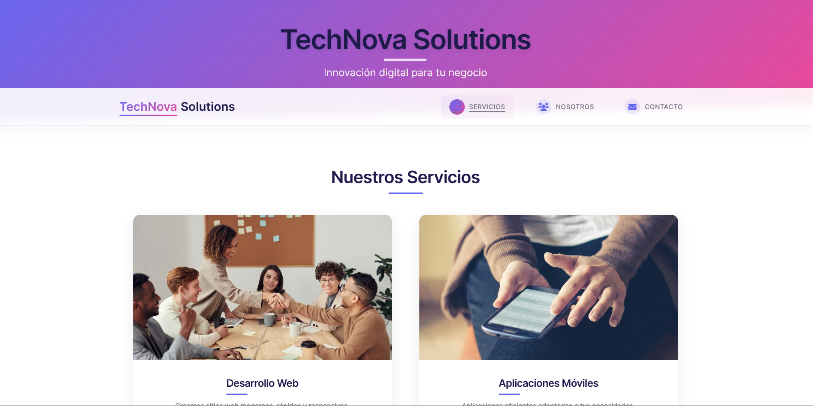
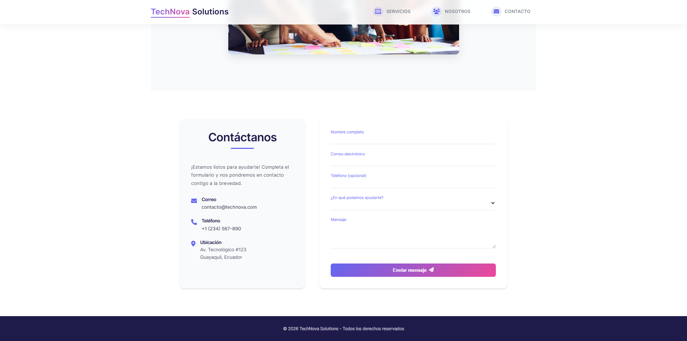

# 🚀 TechNova Solutions - Landing Page

<div align="center">
  
  
  
  
  
</div>

## 📋 Descripción del Proyecto

Landing page moderna y completamente responsiva para **TechNova Solutions**, una empresa de soluciones tecnológicas innovadoras. El diseño incluye:

- ✨ Diseño moderno y atractivo
- 📱 Totalmente responsivo (se adapta a móviles, tablets y escritorio)
- ⚡ Optimizado para rendimiento
- 🎨 Paleta de colores profesional
- 🔍 Navegación fluida con scroll suave

## 🛠️ Tecnologías Utilizadas

- **Frontend**:
  - HTML5 semántico
  - CSS3 con variables personalizadas
  - Font Awesome para iconos
  - Google Fonts (Inter)


## 📸 Capturas de Pantalla

<div align="center">
  <div style="display: flex; flex-wrap: wrap; justify-content: center; gap: 20px; margin: 20px 0;">
    <div style="flex: 1; min-width: 300px; max-width: 100%;">
      <h3>Vista Principal</h3>
      
    </div>
    <div style="flex: 1; min-width: 300px; max-width: 100%;">
      <h3>Sección de Servicios</h3>
      
    </div>
  </div>
</div>

## 🎨 Características Principales

### 🌐 Secciones
- **Inicio**: Presentación de la empresa con llamada a la acción
- **Servicios**: Muestra de los servicios ofrecidos con imágenes atractivas
- **Nosotros**: Información sobre el equipo y la empresa
- **Contacto**: Formulario de contacto con validación HTML5

### 🎯 Características Técnicas
- Diseño modular y escalable con puro CSS
- Código limpio, semántico y bien documentado
- Optimizado para SEO y accesibilidad
- Animaciones y transiciones fluidas con CSS3
- Validación de formularios con HTML5
- Menú móvil responsive sin JavaScript
- Efectos visuales avanzados con CSS puro

## 👥 Equipo de Desarrollo - Grupo 1

| Rol | Nombre | Tareas Principales |
|-----|--------|-------------------|
| **Líder del Proyecto** | Almeida Coello Byron Omar | Coordinación del equipo, estructura HTML semántica |
| **Diseñadora UI/UX** | Andrade Loor Thalia Mercedes | Diseño de interfaz, paleta de colores, experiencia de usuario |
| **Maquetador Web** | Jaramillo Rivera John David | Implementación de maquetación CSS, efectos visuales |
| **Desarrolladora Frontend** | Mora Quijije Yaritza Cristhel | Estilos CSS avanzados, diseño responsivo |

## 🚀 Cómo Iniciar

1. Clona el repositorio:
   ```bash
   git clone [URL_DEL_REPOSITORIO]
   ```
2. Abre el archivo `landingpage.html` en tu navegador web.
3. ¡Explora y disfruta del diseño!

## 📱 Compatibilidad

- Navegadores modernos (Chrome, Firefox, Safari, Edge)
- Diseño responsivo para móviles, tablets y escritorio
- Soporte para pantallas de alta resolución (Retina)

## 📝 Notas Adicionales

- Los iconos utilizados son de [Font Awesome](https://fontawesome.com/)
- Las fuentes son cargadas desde [Google Fonts](https://fonts.google.com/)
- Todas las imágenes son de uso libre o bajo licencia

## 📬 Contacto

¿Tienes preguntas o sugerencias? ¡Nos encantaría escucharte!

📧 [contacto@technova.com](mailto:contacto@technova.com)

---

<div align="center">
  <p>✨ Desarrollado con pasión por el Grupo 1 - 2026 ✨</p>
</div>
